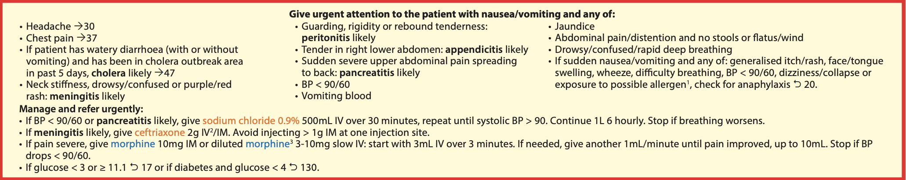
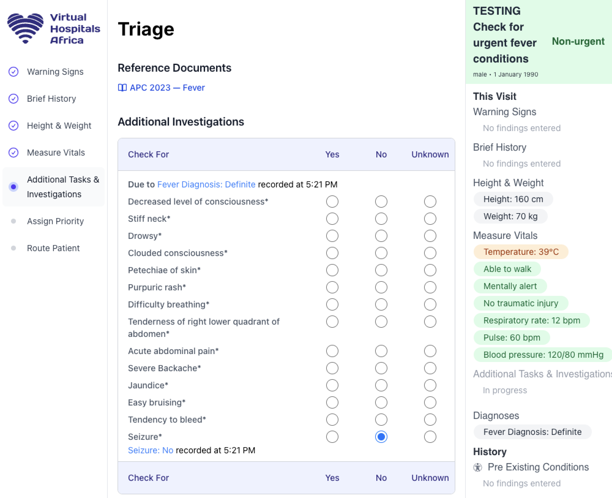

# Virtual Hospitals Africa: Clinical Decision Support Architecture & Methodology

Virtual Hospitals Africa is a cloud-based patient management platform with embedded rules-based clinical decision support enabling health workers to more accurately prioritize and treat patients based on logical rules grounded national and international standards. [The interactive tutorial](https://za.virtualhospitalsafrica.org/tutorial) gives a guided tour of the user experience from the perspective of a rural nurse conducting triage. 

This document describes how that works: what guidance we utilize, how that is leveraged, the architecture behind the application and rules engine, and how we verify its accuracy.

## Alignment with South African National Standards

The clinical rules in this system are drawn from South Africa's national standards:

**South African Triage Scale (SATS)** assigns every patient a priority level — <span style="color:red">Emergency</span>, <span style="color:orange">Very Urgent</span>, <span style="color:goldenrod">Urgent</span>, or <span style="color:green">Non-urgent</span> — based on the presence of specific warning signs and a Triage Early Warning Score that is weighted higher for abnormal vital signs. In addition to informing the priority level and target time to treatment, the [SATS Manual](https://emssa.org.za/wp-content/uploads/2011/04/SATS-Manual-A5-LR-spreads.pdf) gives additional tasks and investigations to perform such as providing analgesia for burns or measuring blood oxygen levels if the respiratory rate is at all abnormal.

**Practical Approach to Care Kit (PACK) / Adult Primary Care (APC) guidelines** provide symptom-by-symptom clinical pathways for primary care. The [Adult Primary Care guidelines](https://knowledgehub.health.gov.za/system/files/elibdownloads/2023-10/APC_2023_Clinical_tool-PRINT.pdf) provides a 1-2 page reference for common categories of patient complaints and finding sites (body structures). For each, the document recommends findings/measurements to check for that would be urgent if present and/or indicative of a specific underlying condition e.g., Patient has a lump -> check for a pulsating lump which would indicate that an aneurysm is likely and that the case should be refered urgently.

**Standard Treatment Guidelines (STG) and Essential Medicines List (EML)** inform the recommended doses and treatment protocols surfaced when a diagnosis is confirmed. Medicines are indexed against the South African EML, and recommended dose ranges are encoded with reference to the EML Version 1.1.

## Architecture

Virtual Hospitals Africa is an open source Deno/Fresh web application deployed to Amazon Web Services’s Cape Town data center, their only such hosting facility on the African continent. Clinical decision support is backed by a determistic rules engine, described in more detail below. That rules engine reads and writes records based on an underlying medical model with several properties that enable flexibility, traceability, and flexibility.

### Medical Model

Within VHA, patient records form an append-only graph with each record having a "root" [SNOMED](https://browser.ihtsdotools.org/?perspective=full&conceptId1=61462000&edition=MAIN/2025-01-01&release=&languages=en) concept describing its category and a "specific" SNOMED concept describing the record. Records can evaluate or qualify other records, which may themselves be evaluated or qualified enabling records of arbitrary depth, e.g., a "Sudden Onset" record qualifying an "Itching" record means "Sudden Onset Itching". To edit a record we save a new record that evaluates the first record as "Entered in error".

There are many advantages of this approach over saving records as editable free text:

1. **Canonical representation**: health workers can search for medical concepts by their alias, but records will appear in the interface using the term's fully specified name for consistency
2. **Set relationships**: as we'll describe in more detail in reference to the rules engine, SNOMED's rich ontology encodes many relationships between concepts including finding sites, associated morphology, and “is a” relationships. So by using codes to represent records a health worker can record “Snake bite” and the a rule for “Bite — wound” will fire because a “Snake bite” "is a" "Bite — wound".
3. **Traceability & Improved Error Handling**: disallowing records from being modified makes the system more parallelizable and traceable, key characteristics if the system ever does not behave as inspected. Because we save records in perpetuity without modification, we can audit precisely how a record came to be and potentially remediate.

### Rules Engine

The rules engine is a determistic system where rules are encoded as S-expressions, taking effect when some condition has been met. So in the example, 

<div style="page-break-after: always;"></div>

```lisp
(system_diagnosis_rule
  "Diagnose probable appendicitis based on nausea"
  (diagnosis
    (snomed_concept "Acute appendicitis" "disorder")
    probable
  )
  adult
  (and
    (or
      (clinical_finding (snomed_concept "Nausea" "finding"))
      (clinical_finding (snomed_concept "Finding of vomiting" "finding"))
    )
    (clinical_finding (snomed_concept "Tenderness of right lower quadrant of abdomen" "finding"))
  )
)
```

the system will diagnose that acute appendicitis is probable if there is an adult patient with tenderness of the right lower quadrant of their abdomen and either nausea or vomiting, as specified in the guidance in the APC 2023 manual.



The rules engine runs as part of an events-based system, processing patient records in between form submission and loading the subsequent page. Rules take the form of:
1. **Tasks & Investigations**: procedures for the health worker to do in response to findings, e.g., check for dilated pupils, measure blood oxygen saturation, raise the patient's legs. [Github](https://github.com/Virtual-Hospitals-Africa/virtual-hospitals-africa/tree/main/s_expression/tasks)
2. **Reference Documents**: links to the specific pages of the reference materials allowing for cross-checking and more detailed visuals and instructions. [Github](https://github.com/Virtual-Hospitals-Africa/virtual-hospitals-africa/blob/collapse-thing/shared/adult_pac_table_of_contents_to_snomed.ts#L0-L1)
3. **Priority Evaluations**: evaluations of the patient's priority levels given a finding or diagnosis or a combination of findings. [Github](https://github.com/Virtual-Hospitals-Africa/virtual-hospitals-africa/tree/main/s_expression/system_priority_evaluations)
4. **System Diagnoses**: evaluations of probable conditions based on a combination of findings. Corresponds with a condition being marked *likely* in the primary care guidelines. [Github](https://github.com/Virtual-Hospitals-Africa/virtual-hospitals-africa/tree/main/s_expression/system_diagnosis_rules)
5. **Recommended Dose Schedules**: recommended medications and dosages based on a confirmed diagnosis. Accounts for a patient's age, weight, and gives special instructions for health workers to check up on. [Github](https://github.com/Virtual-Hospitals-Africa/virtual-hospitals-africa/tree/main/backend/recommended_doses/parsed/recommended_doses.json)

## Evidence of Correctness

Several levels of testing help ensure that this clinical decision support system is accurate and performant.

### Automated Testing

We run a suite [automated tests](https://github.com/Virtual-Hospitals-Africa/virtual-hospitals-africa/tree/main/test/web/patients/open_encounter/triage) that simulate a health worker taking a patient through the full triage workflow — from recording warning signs and measuring vital signs, to receiving a task list and a triage priority. These tests run against a real database and a running instance of the application; they do not use shortcuts or simulations.

The tests verify specific clinical scenarios drawn from the guidelines: for example, that a patient presenting with chest pain is prompted to check for an irregular pulse and severe pain; that a patient with an insect bite and low blood pressure is assigned a probable anaphylaxis diagnosis; and that the correct SATS urgency level is assigned based on the combination of recorded vital signs and symptoms. If any rule is changed in a way that alters clinical behaviour, these tests will fail, preventing that change from being deployed.

### Load testing 

In addition to testing the validity of the scenarios, we also measure the performance ensuring that latencies are low so that health workers can proceed smoothly through their work. Waiting on a slow system is painful in general and obviously that is even more the case in an urgent scenario, so we have taken several steps to ensure that processing is fast even for users on low range devices.

1. **Server-side processing**: almost all computation takes place on the server where we have more control and capacity compared with relying on users' devices
2. **Pre-compute**: A single rule may refer to a combination of concepts, each of which has many descendants. To latency runtime, we precompute for all SNOMED concepts what rules they could possibly apply to, turning a potentially long graph traversal into a simple lookup.
3. **Batch processing**: Generally speaking, a single form submission which may contain many findings is consolidated into a single request to the database
4. **Non-blocking logic**: We let the user record findings while rules are processing in the background for most pages

In load testing we found that the system performs well even with many concurrent patients, consistently processing the whole cycle (send completed web page, insert findings, run rules engine) in well under 400 milliseconds even with 100 patients being handled concurrently. With response times this fast, we expect that the rate-limiting factor to be the bandwidth of devices rather than the speed at which we generate responses. Contrast this with LLMs which for the higher reasoning models can have far longer runtimes. The results of these tests across different rules is included at the end of this document.

### Manual code review by licensed medical professionals

Unlike black box language models whose behavior (with any nonzero [temperature](https://www.ibm.com/think/topics/llm-temperature)) is nondetermistic, our system has human-readable rules as artifacts.

Our Chief Medical Officer, Dr. Sikhululiwe Ngwenya, is leading the effort to cross-check all our rules for 1:1 parity with their corresponding guidance documents. If discrepancies are encountered now or in the future, the process to change them is simple, altering the rules and adding a test case to confirm the new behavior.

### Manual user interface review by licensed medical professionals

The [apc-test-results](https://github.com/Virtual-Hospitals-Africa/virtual-hospitals-africa/tree/main/apc-test-results) folder contains screenshots of the running application, one per presenting complaint, showing exactly what a health worker sees as the prioritization, reference documents, additional tasks during triage.



These screenshots serve as a visual audit trail: a clinician reviewing the guidelines can open the corresponding chapter of the APC document and verify that the system is asking for exactly the right things.

## Conclusion

Virtual Hospitals Africa's architecture, testing, and review processes help ensure that our system and clinical guidance are accurate and responsive, ensuring that we can serve health workers even in resource poor settings.

<div style="page-break-after: always;"></div>

| num_patients | page | task definition | warning signs avg ms | warning signs median ms | brief history avg ms | brief history median ms | height and weight avg ms | height and weight median ms | measure vitals avg ms | measure vitals median ms |
| --- | --- | --- | --- | --- | --- | --- | --- | --- | --- | --- |
| 10 | 63-back-pain | Check for urgent back pain conditions | 170 | 133 | 131 | 114 | 139 | 116 | 247 | 239 |
| 10 | 57-abnormal-vaginal-bleeding | Check for urgent vaginal bleeding conditions | 143 | 145 | 114 | 114 | 109 | 108 | 216 | 212 |
| 10 | 28-collapse-falls | Check for urgent collapse conditions | 178 | 170 | 102 | 101 | 105 | 104 | 237 | 238 |
| 10 | 26-weakness-or-tiredness | Check for urgent weakness/tiredness conditions | 118 | 111 | 109 | 104 | 116 | 110 | 230 | 228 |
| 10 | 21-burns | Check for urgent burn conditions | 140 | 135 | 106 | 101 | 109 | 107 | 241 | 241 |
| 10 | 21-burns | Measure Bloody Oxygen Saturation due to burns | 146 | 143 | 107 | 107 | 108 | 106 | 242 | 233 |
| 10 | 19-seizures | Check for urgent seizure conditions | 107 | 107 | 107 | 105 | 117 | 119 | 207 | 208 |
| 10 | 48-constipation-and-anal-symptoms | Check for urgent constipation conditions | 106 | 106 | 112 | 112 | 128 | 126 | 214 | 208 |
| 10 | 48-constipation-and-anal-symptoms | Check for urgent anal conditions | 115 | 104 | 116 | 118 | 130 | 127 | 211 | 207 |
| 10 | 37-chest-pain | Check for urgent chest pain conditions | 226 | 171 | 115 | 107 | 134 | 122 | 235 | 222 |
| 10 | 41-acute-covid-19 | Check for urgent acute Covid-19 conditions | 114 | 109 | 112 | 110 | 121 | 120 | 264 | 256 |
| 10 | 80-scalp-symptoms | Check for urgent scalp conditions | 111 | 112 | 116 | 115 | 140 | 136 | 220 | 217 |
| 10 | 36-gum-teeth-symptoms | Check for urgent dental conditions | 112 | 109 | 114 | 114 | 122 | 115 | 256 | 258 |
| 10 | 79-changes-in-skin-colour | Check for urgent skin colour change conditions | 136 | 111 | 126 | 115 | 148 | 137 | 290 | 275 |
| 10 | 59-urinary-symptoms | Check for urgent urinary symptom conditions | 110 | 109 | 112 | 107 | 133 | 129 | 253 | 250 |
| 10 | 137-ischaemic-heart-disease | Check for urgent ischaemic heart disease conditions | 128 | 113 | 114 | 111 | 127 | 118 | 209 | 211 |
| 10 | 42-ongoing-covid-19-symptoms | Check for urgent ongoing Covid-19 symptoms | 108 | 108 | 106 | 106 | 123 | 122 | 236 | 236 |
| 10 | 39-wheeze-or-tight-chest | Check for urgent wheeze or tight chest conditions | 127 | 120 | 153 | 113 | 118 | 109 | 208 | 209 |
| 10 | 82-nail-symptoms | Check for urgent nail symptom conditions | 138 | 122 | 129 | 118 | 133 | 132 | 341 | 316 |
| 10 | 164-postnatal-care | Check for urgent postnatal conditions | 115 | 110 | 119 | 115 | 136 | 129 | 242 | 216 |
| 10 | 139-peripheral-vascular-disease | Check for urgent peripheral vascular disease conditions | 114 | 110 | 119 | 110 | 126 | 124 | 216 | 220 |
| 10 | 86-low-mood-stress-and-anxiety | Check for urgent low mood, stress and anxiety conditions | 120 | 114 | 111 | 110 | 141 | 134 | 234 | 227 |
| 10 | 66-foot-symptoms | Check for urgent foot symptom conditions | 132 | 117 | 117 | 115 | 138 | 129 | 284 | 285 |
| 10 | 73-drug-rash | Check for urgent drug rash conditions | 129 | 126 | 115 | 113 | 118 | 117 | 256 | 265 |
| 10 | 45-nausea-or-vomiting | Check for urgent nausea or vomiting conditions | 258 | 226 | 116 | 115 | 125 | 115 | 264 | 247 |
| 10 | 29-dizziness | Check for urgent dizziness conditions | 190 | 185 | 104 | 103 | 111 | 110 | 194 | 191 |
| 10 | 25-lump-swelling-in-neck-axilla-or-groin | Check for urgent groin lump conditions | 114 | 112 | 111 | 112 | 121 | 111 | 215 | 214 |
| 10 | 40-covid-19-diagnosis | Check for presence of Covid-19 | 107 | 103 | 107 | 105 | 121 | 122 | 211 | 210 |
| 10 | 65-leg-symptoms | Check for urgent leg symptom conditions | 134 | 112 | 110 | 109 | 144 | 138 | 261 | 256 |
| 10 | 159-antenatal-care | Check for urgent antenatal conditions | 114 | 112 | 132 | 117 | 127 | 131 | 225 | 226 |
| 10 | 44-abdominal-pain | Check for urgent abdominal pain conditions | 192 | 177 | 103 | 103 | 116 | 104 | 220 | 215 |
| 10 | 51-abnormal-vaginal-discharge | Check for urgent female genitalia conditions | 110 | 107 | 123 | 118 | 132 | 133 | 224 | 217 |
| 10 | 33-ear-symptoms | Check for urgent ear symptom conditions | 139 | 110 | 119 | 115 | 130 | 126 | 230 | 219 |
| 10 | 34-nose-symptoms | Check for urgent nose conditions | 136 | 118 | 129 | 118 | 149 | 133 | 313 | 311 |
| 10 | 83-self-harm-or-suicide | Check for urgent self-harm or suicide conditions | 126 | 121 | 123 | 114 | 125 | 120 | 249 | 251 |
| 10 | 31-eye-vision-symptoms | Check for urgent eye or vision conditions | 118 | 113 | 114 | 109 | 123 | 120 | 264 | 264 |
| 10 | 78-crusts-or-flaky-skin | Check for urgent skin conditions with crusts or flaky skin | 119 | 114 | 117 | 117 | 132 | 130 | 240 | 241 |
| 10 | 64-neck-pain-arm-hand | Check for urgent arm or hand symptom conditions | 128 | 115 | 115 | 109 | 147 | 137 | 251 | 250 |
| 10 | 64-neck-pain-arm-hand | Check for urgent neck pain conditions | 140 | 133 | 159 | 122 | 132 | 125 | 250 | 262 |
| 10 | 30-headache | Check for urgent headache conditions | 143 | 139 | 123 | 122 | 132 | 125 | 296 | 292 |
| 10 | 32-face-symptoms | Check for urgent face symptom conditions | 119 | 115 | 117 | 120 | 143 | 141 | 310 | 306 |
| 10 | 35-mouth-or-throat-symptoms | Check for urgent mouth or throat conditions | 137 | 122 | 112 | 112 | 140 | 130 | 255 | 258 |
| 10 | 46-diarrhoea | Check for urgent diarrhoea conditions | 136 | 121 | 121 | 112 | 114 | 108 | 235 | 228 |
| 10 | 38-cough-or-difficulty-breathing | Check for urgent cough/breathing conditions | 214 | 214 | 137 | 122 | 117 | 117 | 223 | 207 |
| 10 | 22-bites-and-stings | Check for urgent bite/sting conditions | 141 | 139 | 122 | 110 | 148 | 117 | 241 | 237 |
| 10 | 22-bites-and-stings | Check for snake bite | 177 | 166 | 119 | 117 | 128 | 121 | 218 | 214 |
| 10 | 62-joint-symptoms | Check for urgent joint conditions | 126 | 118 | 120 | 116 | 137 | 131 | 262 | 254 |
| 10 | 67-skin-symptoms | Check for urgent skin symptom conditions | 133 | 122 | 131 | 120 | 131 | 131 | 268 | 254 |
| 10 | 75-skin-ulcer-or-non-healing-wound | Check for urgent skin ulcer and wound conditions | 129 | 121 | 114 | 115 | 155 | 126 | 295 | 287 |
| 10 | 74-skin-lumps | Check for urgent skin lump conditions | 114 | 116 | 105 | 105 | 128 | 123 | 275 | 274 |
| 10 | 74-skin-lumps | Measure lesion size | 121 | 119 | 112 | 112 | 130 | 133 | 272 | 270 |
| 10 | 50-genital-symptoms-man | Check for urgent genital symptoms in a man | 135 | 118 | 112 | 114 | 136 | 127 | 232 | 224 |
| 100 | 63-back-pain | Check for urgent back pain conditions | 137 | 131 | 115 | 112 | 120 | 110 | 244 | 236 |
| 100 | 57-abnormal-vaginal-bleeding | Check for urgent vaginal bleeding conditions | 141 | 136 | 117 | 109 | 113 | 110 | 222 | 217 |
| 100 | 28-collapse-falls | Check for urgent collapse conditions | 185 | 174 | 109 | 105 | 115 | 111 | 252 | 242 |
| 100 | 26-weakness-or-tiredness | Check for urgent weakness/tiredness conditions | 120 | 111 | 113 | 108 | 122 | 118 | 241 | 240 |
| 100 | 21-burns | Check for urgent burn conditions | 148 | 142 | 111 | 108 | 115 | 111 | 261 | 256 |
| 100 | 21-burns | Measure Bloody Oxygen Saturation due to burns | 153 | 147 | 116 | 114 | 112 | 111 | 254 | 255 |
| 100 | 19-seizures | Check for urgent seizure conditions | 123 | 113 | 116 | 114 | 129 | 128 | 223 | 217 |
| 100 | 48-constipation-and-anal-symptoms | Check for urgent constipation conditions | 118 | 110 | 113 | 111 | 124 | 124 | 223 | 223 |
| 100 | 48-constipation-and-anal-symptoms | Check for urgent anal conditions | 118 | 110 | 114 | 111 | 125 | 126 | 217 | 219 |
| 100 | 37-chest-pain | Check for urgent chest pain conditions | 185 | 175 | 119 | 115 | 115 | 113 | 231 | 227 |
| 100 | 41-acute-covid-19 | Check for urgent acute Covid-19 conditions | 124 | 114 | 118 | 116 | 134 | 132 | 280 | 274 |
| 100 | 80-scalp-symptoms | Check for urgent scalp conditions | 124 | 113 | 117 | 115 | 131 | 128 | 236 | 227 |
| 100 | 36-gum-teeth-symptoms | Check for urgent dental conditions | 125 | 116 | 116 | 116 | 136 | 131 | 274 | 272 |
| 100 | 79-changes-in-skin-colour | Check for urgent skin colour change conditions | 134 | 119 | 120 | 118 | 140 | 138 | 291 | 286 |
| 100 | 59-urinary-symptoms | Check for urgent urinary symptom conditions | 128 | 117 | 121 | 119 | 139 | 135 | 280 | 279 |
| 100 | 137-ischaemic-heart-disease | Check for urgent ischaemic heart disease conditions | 130 | 121 | 126 | 120 | 125 | 121 | 232 | 233 |
| 100 | 42-ongoing-covid-19-symptoms | Check for urgent ongoing Covid-19 symptoms | 126 | 116 | 117 | 115 | 145 | 135 | 259 | 254 |
| 100 | 39-wheeze-or-tight-chest | Check for urgent wheeze or tight chest conditions | 141 | 129 | 121 | 118 | 128 | 120 | 237 | 242 |
| 100 | 82-nail-symptoms | Check for urgent nail symptom conditions | 124 | 113 | 114 | 111 | 134 | 132 | 296 | 290 |
| 100 | 164-postnatal-care | Check for urgent postnatal conditions | 121 | 113 | 119 | 118 | 134 | 132 | 228 | 226 |
| 100 | 139-peripheral-vascular-disease | Check for urgent peripheral vascular disease conditions | 122 | 117 | 118 | 116 | 132 | 128 | 230 | 231 |
| 100 | 86-low-mood-stress-and-anxiety | Check for urgent low mood, stress and anxiety conditions | 136 | 125 | 127 | 123 | 147 | 142 | 253 | 254 |
| 100 | 66-foot-symptoms | Check for urgent foot symptom conditions | 129 | 117 | 122 | 119 | 145 | 141 | 303 | 299 |
| 100 | 73-drug-rash | Check for urgent drug rash conditions | 137 | 130 | 125 | 120 | 125 | 121 | 277 | 275 |
| 100 | 45-nausea-or-vomiting | Check for urgent nausea or vomiting conditions | 241 | 226 | 122 | 116 | 129 | 123 | 981 | 944 |
| 100 | 29-dizziness | Check for urgent dizziness conditions | 202 | 193 | 126 | 125 | 123 | 119 | 225 | 218 |
| 100 | 25-lump-swelling-in-neck-axilla-or-groin | Check for urgent groin lump conditions | 127 | 121 | 135 | 130 | 141 | 141 | 244 | 242 |
| 100 | 40-covid-19-diagnosis | Check for presence of Covid-19 | 129 | 121 | 131 | 130 | 150 | 147 | 237 | 235 |
| 100 | 65-leg-symptoms | Check for urgent leg symptom conditions | 126 | 120 | 124 | 122 | 143 | 143 | 257 | 251 |
| 100 | 159-antenatal-care | Check for urgent antenatal conditions | 120 | 116 | 122 | 122 | 140 | 141 | 230 | 230 |
| 100 | 44-abdominal-pain | Check for urgent abdominal pain conditions | 196 | 191 | 120 | 119 | 128 | 123 | 717 | 698 |
| 100 | 51-abnormal-vaginal-discharge | Check for urgent female genitalia conditions | 120 | 116 | 124 | 123 | 142 | 143 | 222 | 223 |
| 100 | 33-ear-symptoms | Check for urgent ear symptom conditions | 123 | 118 | 128 | 126 | 143 | 143 | 228 | 228 |
| 100 | 34-nose-symptoms | Check for urgent nose conditions | 129 | 121 | 124 | 124 | 144 | 142 | 282 | 280 |
| 100 | 83-self-harm-or-suicide | Check for urgent self-harm or suicide conditions | 124 | 121 | 124 | 123 | 143 | 145 | 237 | 237 |
| 100 | 31-eye-vision-symptoms | Check for urgent eye or vision conditions | 124 | 120 | 121 | 121 | 142 | 144 | 261 | 257 |
| 100 | 78-crusts-or-flaky-skin | Check for urgent skin conditions with crusts or flaky skin | 125 | 118 | 124 | 124 | 144 | 144 | 240 | 239 |
| 100 | 64-neck-pain-arm-hand | Check for urgent arm or hand symptom conditions | 134 | 129 | 127 | 126 | 149 | 146 | 259 | 252 |
| 100 | 64-neck-pain-arm-hand | Check for urgent neck pain conditions | 136 | 128 | 135 | 130 | 148 | 145 | 235 | 232 |
| 100 | 30-headache | Check for urgent headache conditions | 148 | 139 | 126 | 125 | 133 | 129 | 260 | 256 |
| 100 | 32-face-symptoms | Check for urgent face symptom conditions | 132 | 123 | 127 | 125 | 146 | 145 | 278 | 274 |
| 100 | 35-mouth-or-throat-symptoms | Check for urgent mouth or throat conditions | 132 | 122 | 127 | 126 | 151 | 145 | 255 | 253 |
| 100 | 46-diarrhoea | Check for urgent diarrhoea conditions | 145 | 138 | 128 | 128 | 133 | 129 | 234 | 233 |
| 100 | 38-cough-or-difficulty-breathing | Check for urgent cough/breathing conditions | 237 | 229 | 132 | 132 | 130 | 128 | 735 | 711 |
| 100 | 22-bites-and-stings | Check for urgent bite/sting conditions | 158 | 155 | 128 | 128 | 130 | 126 | 242 | 241 |
| 100 | 22-bites-and-stings | Check for snake bite | 161 | 157 | 135 | 133 | 126 | 124 | 246 | 245 |
| 100 | 62-joint-symptoms | Check for urgent joint conditions | 137 | 128 | 134 | 131 | 152 | 150 | 250 | 249 |
| 100 | 67-skin-symptoms | Check for urgent skin symptom conditions | 151 | 139 | 142 | 139 | 174 | 171 | 295 | 291 |
| 100 | 75-skin-ulcer-or-non-healing-wound | Check for urgent skin ulcer and wound conditions | 144 | 136 | 137 | 135 | 172 | 166 | 313 | 305 |
| 100 | 74-skin-lumps | Check for urgent skin lump conditions | 141 | 134 | 136 | 133 | 170 | 167 | 311 | 305 |
| 100 | 74-skin-lumps | Measure lesion size | 135 | 132 | 137 | 134 | 169 | 167 | 311 | 306 |
| 100 | 50-genital-symptoms-man | Check for urgent genital symptoms in a man | 156 | 140 | 147 | 141 | 182 | 171 | 289 | 268 |